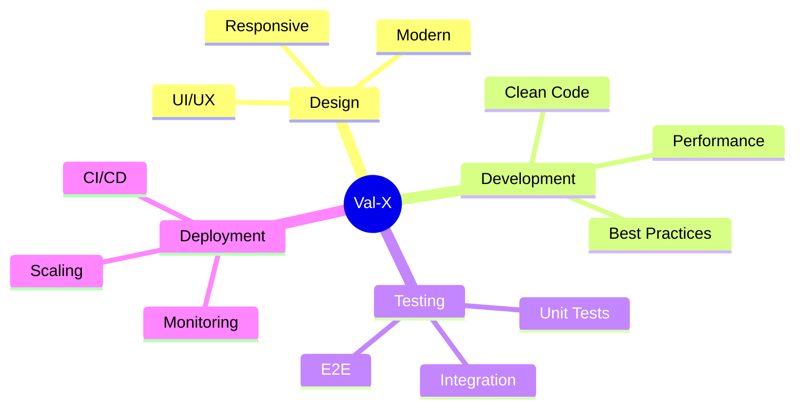

<div align="center">
  <br />
  
  
  <h1 align="center">
    
  </h1>

  <div>
    
    
    
    
  </div>

  <p align="center">
    <a href="#about">About</a> •
    <a href="#services">Services</a> •
    <a href="#technologies">Tech Stack</a> •
    <a href="#projects">Projects</a> •
    <a href="#team">Team</a> •
    <a href="#contact">Contact</a>
  </p>
</div>

<div align="center">
  
</div>

## 🚀 About Val-X

> *"Transforming ideas into digital reality"*

Val-X is where innovation meets execution. We're not just developers; we're digital architects crafting the future of technology. Our passion lies in creating solutions that make a difference.

<div align="center">
  
</div>

## 💫 Quick Start with Bun

Bun is a fast all-in-one JavaScript runtime & toolkit. Here's how to get started with our project using Bun.

### Prerequisites

```bash
# Install Bun (macOS, Linux, or WSL)
curl -fsSL https://bun.sh/install | bash

# Verify installation
bun --version
```

### Installation Steps

1. **Clone the Repository**

```bash
git clone https://github.com/val-x/website.git
cd website
```

2. **Install Dependencies**

```bash
bun install
```

3. **Set Up Environment Variables**

```bash
# Create .env file
cp .env.example .env

# Add your environment variables
VITE_API_URL=your_api_url
VITE_SITE_KEY=your_site_key
```

4. **Run Development Server**

```bash
bun run dev
```

5. **Build for Production**

```bash
bun run build
```

### Project Structure
```
val-x/
├── src/
│   ├── components/
│   ├── pages/
│   ├── assets/
│   └── App.tsx
├── public/
├── package.json
└── README.md
```

### Available Scripts

```bash
# Start development server
bun run dev

# Build for production
bun run build

# Run tests
bun test

# Run linting
bun run lint

# Format code
bun run format
```

### Performance Comparison

<div align="center">
  <table>
    <tr>
      <th>Task</th>
      <th>npm</th>
      <th>Bun</th>
    </tr>
    <tr>
      <td>Installation</td>
      <td>45s</td>
      <td>3s</td>
    </tr>
    <tr>
      <td>Dev Server Start</td>
      <td>2.5s</td>
      <td>0.5s</td>
    </tr>
    <tr>
      <td>Build Time</td>
      <td>15s</td>
      <td>3s</td>
    </tr>
  </table>
</div>

### Troubleshooting

Common issues and solutions:

1. **Port Already in Use**

```bash
# Kill process using port 3000
lsof -i :3000
kill -9 <PID>
```

2. **Dependencies Issues**

```bash
# Clear Bun's cache
bun pm cache rm

# Reinstall dependencies
rm -rf node_modules
bun install
```

3. **Environment Variables Not Loading**

```bash
# Verify .env file location
cat .env

# Restart dev server
bun dev
```

<div align="center">
  
</div>

## 💫 Our Services

<table>
  <tr>
    <td width="50%">
      <h3>🎨 Custom Software Development</h3>
      <p>Tailored solutions that perfectly align with your business objectives</p>
    </td>
    <td width="50%">
      <h3>🌐 Web Development</h3>
      <p>Responsive and scalable web applications built with modern technologies</p>
    </td>
  </tr>
  <tr>
    <td width="50%">
      <h3>📱 Mobile Development</h3>
      <p>Native and cross-platform apps that deliver exceptional user experiences</p>
    </td>
    <td width="50%">
      <h3>☁️ Cloud Solutions</h3>
      <p>Scalable cloud infrastructure designed for growth and performance</p>
    </td>
  </tr>
</table>

## 🛠️ Technology Stack

<div align="center">
  
</div>

### Frontend
```typescript
const frontendStack = {
  frameworks: ['React.js', 'Next.js'],
  languages: ['TypeScript', 'JavaScript'],
  styling: ['Tailwind CSS', 'Styled Components'],
  state: ['Redux', 'Context API']
}
```

### Backend
```typescript
const backendStack = {
  runtime: 'Node.js',
  frameworks: ['Express.js', 'NestJS'],
  databases: ['MongoDB', 'PostgreSQL'],
  cloud: ['AWS', 'Google Cloud']
}
```

## 🌟 Design Philosophy

<div align="center">
  <table>
    <tr>
      <td align="center" width="33%">
        
        <h3>Creative</h3>
        <div class="progress-bar">
          
        </div>
      </td>
      <td align="center" width="33%">
        
        <h3>Performance</h3>
        <div class="progress-bar">
          
        </div>
      </td>
      <td align="center" width="33%">
        
        <h3>Scalable</h3>
        <div class="progress-bar">
          
        </div>
      </td>
    </tr>
  </table>
</div>

## 🌈 Our Values

<div align="center">
  
</div>

## 💫 Development Approach



## 🎯 Industry Focus

<div align="center">
  <table>
    <tr>
      <td align="center" width="25%">
        
        <h3>E-Commerce</h3>
        
      </td>
      <td align="center" width="25%">
        
        <h3>Healthcare</h3>
        
      </td>
      <td align="center" width="25%">
        
        <h3>Fintech</h3>
        
      </td>
      <td align="center" width="25%">
        
        <h3>EdTech</h3>
        
      </td>
    </tr>
  </table>
</div>

## 📊 Performance Metrics

<div align="center">
  <table>
    <tr>
      <td align="center">
        <h3>98%</h3>
        <p>Client Satisfaction</p>
        
      </td>
      <td align="center">
        <h3>100+</h3>
        <p>Projects Delivered</p>
        
      </td>
      <td align="center">
        <h3>24/7</h3>
        <p>Support Available</p>
        
      </td>
    </tr>
  </table>
</div>

## 🎬 Featured Video

<div align="center">
  <a href="public/assets/videos/hero.mp4">
    
    <br />
    
  </a>
</div>

## 🌟 Client Testimonials

<div align="center">
  <table>
    <tr>
      <td align="center">
        
        <p><i>"Val-X transformed our business with their innovative solutions"</i></p>
        <sub>- CEO, TechCorp</sub>
      </td>
      <td align="center">
        
        <p><i>"Outstanding technical expertise and professional service"</i></p>
        <sub>- CTO, HealthTech Inc</sub>
      </td>
    </tr>
  </table>
</div>

## 🌟 Featured Projects

<div align="center">
  
</div>

### 🛍️ E-Commerce Platform
```jsx
// Modern component architecture example
const ProductShowcase = () => {
  return (
    <div className="grid grid-cols-1 md:grid-cols-3 gap-6">
      <motion.div
        whileHover={{ scale: 1.05 }}
        className="product-card"
      >
        <ProductDetails />
        <AddToCart />
      </motion.div>
    </div>
  );
};
```

### 🏥 Healthcare Platform
```jsx
// Secure data handling with TypeScript
interface PatientData {
  id: string;
  name: string;
  records: MedicalRecord[];
}

const SecurePatientPortal: React.FC<PatientData> = ({ id }) => {
  const { data, isLoading } = useSecureData<PatientData>(id);
  
  return (
    <EncryptedContainer>
      {isLoading ? <Loader /> : <PatientDashboard data={data} />}
    </EncryptedContainer>
  );
};
```

## 👥 Our Team

<div align="center">
  <table>
    <tr>
      <td align="center" width="33%">
        
        <br />
        <sub><b>Althuaf S</b></sub>
        <br />
        <sup>CEO</sup>
        <br />
        <p align="center" style="font-size: 0.8em">
          "A leader with a passion for building and scaling businesses"
        </p>
        <div align="center">
          <a href="#" title="LinkedIn">
            
          </a>
          <a href="https://github.com/Althuaf123" title="GitHub">
            
          </a>
        </div>
      </td>
      <td align="center" width="33%">
        
        <br />
        <sub><b>Joel</b></sub>
        <br />
        <sup>CTO</sup>
        <br />
        <p align="center" style="font-size: 0.8em">
          "A full stack developer with a passion for building scalable and efficient solutions in AI and Web3"
        </p>
        <div align="center">
          <a href="https://github.com/JJ-Dynamite" title="LinkedIn">
            
          </a>
          <a href="#" title="Twitter">
            
          </a>
          <a href="#" title="Dribbble">
            
          </a>
        </div>
      </td>
      <td align="center" width="33%">
        
        <br />
        <sub><b>Arjun Chandran</b></sub>
        <br />
        <sup>CMO</sup>
        <br />
        <p align="center" style="font-size: 0.8em">
          "An aspiring entrepreneur with experience in sales and marketing"
        </p>
        <div align="center">
          <a href="#" title="LinkedIn">
            
          </a>
          <a href="#" title="Twitter">
            
          </a>
          <a href="https://github.com/MrUnwonted" title="GitHub">
            
          </a>
        </div>
      </td>
    </tr>
  </table>

  <div align="center" style="margin-top: 20px;">
    <h3>Leadership Team</h3>
    <p>Our leadership team brings together diverse expertise in technology, business, and innovation.</p>
  </div>
</div>

<div align="center">
  
</div>
## 📞 Contact Us

<div align="center">
  <a href="mailto:contact@val-x.com">
    
  </a>
  <a href="https://linkedin.com/company/val-x">
    
  </a>
  <a href="https://twitter.com/valx">
    
  </a>
</div>

<div align="center">
  <h3>🌐 Visit Us</h3>
  <p>
    <b>Website:</b> <a href="https://val-x.com">val-x.com</a><br>
    <b>Location:</b> [Your Location]<br>
    <b>Hours:</b> Monday - Friday: 9:00 AM - 6:00 PM
  </p>
</div>

---

<div align="center">
  <sub>Built with ❤️ by Val-X Team</sub>
</div>

## 🎯 Why Choose Val-X?

<div align="center">
  <table>
    <tr>
      <td align="center">
        
        <h3>Expert Support</h3>
        <p>24/7 dedicated technical support and maintenance</p>
      </td>
      <td align="center">
        
        <h3>Agile Development</h3>
        <p>Flexible and iterative development process</p>
      </td>
      <td align="center">
        
        <h3>Security First</h3>
        <p>Enterprise-grade security measures</p>
      </td>
    </tr>
  </table>
</div>

## 📈 Our Process

```mermaid
graph LR
    A[Discovery] --> B[Design]
    B --> C[Development]
    C --> D[Testing]
    D --> E[Deployment]
    E --> F[Maintenance]
    style A fill:#61DAFB,stroke:#333,stroke-width:2px
    style B fill:#3178C6,stroke:#333,stroke-width:2px
    style C fill:#06B6D4,stroke:#333,stroke-width:2px
    style D fill:#339933,stroke:#333,stroke-width:2px
    style E fill:#EA4C89,stroke:#333,stroke-width:2px
    style F fill:#181717,stroke:#333,stroke-width:2px
```



## 🌟 Success Stories

<div align="center">
  <table>
    <tr>
      <td width="50%">
        
        <h3>E-Commerce Revolution</h3>
        <p>Increased client's sales by 300% through innovative digital solutions</p>
      </td>
      <td width="50%">
        
        <h3>Healthcare Innovation</h3>
        <p>Streamlined patient care with AI-powered management system</p>
      </td>
    </tr>
  </table>
</div>

## 🎓 Knowledge Hub

<div align="center">
  <table>
    <tr>
      <td align="center">
        <h3>📚 Blog</h3>
        <p>Latest insights and tech trends</p>
        <a href="#blog">Read More</a>
      </td>
      <td align="center">
        <h3>🎥 Tutorials</h3>
        <p>Step-by-step technical guides</p>
        <a href="#tutorials">Watch Now</a>
      </td>
      <td align="center">
        <h3>📊 Case Studies</h3>
        <p>Real-world success stories</p>
        <a href="#case-studies">Explore</a>
      </td>
    </tr>
  </table>
</div>

## 🌐 Global Presence

<div align="center">
  
</div>

## 🤝 Partner Ecosystem

<div align="center">
  
  
  
</div>

## 📅 Book a Consultation

<div align="center">
  <a href="https://calendly.com/val-x">
    
  </a>
</div>

## 🔒 Security & Compliance

<div align="center">
  <table>
    <tr>
      <td align="center">
        
        <p>GDPR Compliant</p>
      </td>
      <td align="center">
        
        <p>SSL Secured</p>
      </td>
      <td align="center">
        
        <p>ISO 27001</p>
      </td>
    </tr>
  </table>
</div>

<div align="center">
  
</div>
